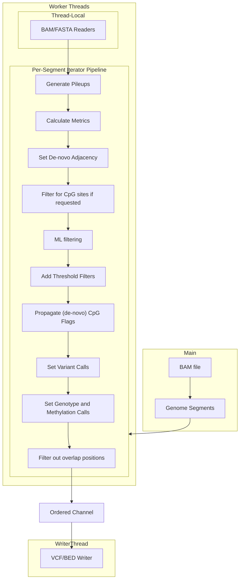

# Rastair Architecture

Rastair performs simultaneous variant and methylation calling from @TAPS sequencing data.
This section describes three key architectural components that enable the robust and performant genome-wide analysis.

## Parallel Pipelined Iterator

Rastair processes genomic data through a parallel architecture
that maintains positional context
while achieving efficient CPU utilization at low memory usage (~250MB per worker thread).

**Segmentation**:
The genome is divided into overlapping segments (typically 1-10 Mb).
Each segment has a "core" region flanked by "overlap" regions.
This design ensures that positions at segment boundaries have access to adjacent positions needed for CpG pair analysis and de-novo CpG detection.
After processing, only core positions are emitted, preventing duplicates.

**Thread-Local Readers**:
Each worker thread maintains its own @BAM and @FASTA file handles, avoiding lock contention and serialize I/O.
Using index files (FAI, CSI, or TBI) enables efficient parallel random access.

**Ordered Channel**:
An ordered channel buffers worker results and reorders them by segment index before forwarding to the writer thread.
A buffer size of 10 times the worker count accommodates work imbalance while preventing unbounded memory growth.
This preserves the strict genomic coordinate ordering required by @VCF format.

**Iterator Pipeline**:
Within each worker, processing proceeds through a lazy iterator chain with progressive filtering:

1. **Pileup generation**: Extract reads from @BAM, build per-position summaries
2. **Calculate metrics**: Depth, allele frequencies, quality scores, etc.
3. **Set de-novo adjacency** (context-aware): Check if adjacent positions could form @denovo sites
4. **Add methylation info**: Analyze strand-specific evidence (OT/OB strands)
5. **Filter site type**: Early filtering to reduce downstream computation
6. **Apply thresholds**: Hard filters on depth, frequency, quality
7. **Add @ML metrics** (context-aware): Random Forest scoring using current and adjacent positions
8. **Propagate CpG flags** (context-aware): Coordinate @CpG pair decisions
9. **Set variant calls**: Classify as variant, methylation, or error
10. **Calls**: Final genotype and @methylation calls
11. **Core filter**: Remove overlap positions

The "context-aware" steps are processed with parameters for the pileup metrics for the current position as well as the ones before and after.
This enables @CpG pair coordination and @denovo detection without breaking the lazy iterator chain.

<!--
Diagram ideas:
- Flowchart showing iterator stages with data flow
- Architecture diagram showing threads + ordered channel
- Sequence diagram showing data transformation through pipeline
-->

## Output Formats

Rastair's internal representation is converted to standard bioinformatics formats for downstream analysis.

### VCF Conversion

Each position generates @VCF records during writer thread processing:
- **One primary record**: Contains all passing alternative alleles (classified as `RealVariant`). For @CpG sites with @methylation evidence but no variants, a ref-only record (REF→`.`) is written.
- **INFO fields**: Include @ML score, methylation beta (ratio of methylated reads to depth), depth metrics, allele frequencies, strand bias statistics, and de-novo CpG flags.
- **Genotype**: Estimated using a simple error model incorporating ML scores and allele frequencies.
- **Filtering**: Records marked `PASS` or with specific filter tags (e.g., `low_depth`, `low_ml_score`).

### BED Format

Compact TSV format for methylation data.
Each line represents a single position with methylation beta, depth, and pass/fail status.
Best for methylation-focused downstream analyses.

## Machine Learning Integration

Random Forest models disambiguate true variants from sequencing errors and methylation artifacts.

**Three Separate Models**: Different variant contexts require different discriminatory features:
- **CpG model**: C→T or G→A at canonical CpG sites
- **De-novo CpG model**: Variants creating new CpG sites
- **Others model**: Non-CpG variants

Models are bundled as one compressed file.
A default model file is bundled in the Rastair binary and loaded at startup.
Custom models for domain-specific tuning can created with rastair's built-in `ml` subcommand and then specified via CLI flags.
