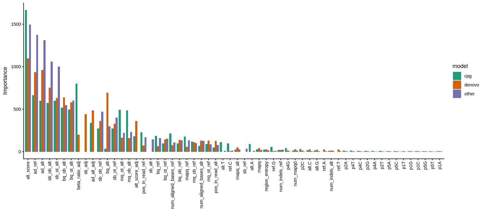

# Machine Learning Models

Rastair uses @ML to distinguish true @methylation calls and variants from sequencing artifacts (and noise).
The ML models evaluate each alt at each position and assign a prediction score for that alt to be a true variant.

By default, ML is enabled with a threshold of `0.5`.
A pre-trained model is bundled with Rastair.

The model handles three contexts with distinct sub-models:
- **@CpG methylation sites**: Standard 5mC detection in @CpG sites
- **@Denovo**: New methylation sites not in reference
- **Other variants**: Non-CpG @SNP:pl and @indel:pl

Some features are shared across models, but some are model specific. Here is a plot of all features used in each model, ranked by importance:



Here, `_adj` refers to a feature of the `adjacent` nucleotide, _ie_ the C when evaluating a G or the G when evaluating a C. All scores that refer to allele counts are normalised either implicitly (where the score itself is a ratio) or explicitly to the total depth at that position. Of note, the `alt_score` is a simple ratiometric score to establish the base-quality weighted enrichment of variant reads over non-variant reads: $$ altscore = \frac{log_{2}(sb_{alt}*bq_{alt}+1)}{log_{2}(sb_{ref}*bq_{ref}+1)} $$, where $sb_{ref/alt}$ refers to the number of reads with ref/alt on the OT (for C positions) or OB (for G positions), and $bq_{ref/alt}$ is the corresponding strand-specific @RMS of base qualities.

The resulting ML scores are calibrated using [Platt scaling](https://en.wikipedia.org/wiki/Platt_scaling), which normalizes score distributions across the three separate sub-models.

## Adjusting the Threshold

After calibration, a threshold of $ 0.5 $ should filter out all candidate variants with less than 50% likelihood of being true. Empirically, we determined this to be a good compromise between sensitivity and specificity. However, you can manually override this:

```bash
rastair call --ml 0.7 input.bam
```

Values above 0.5 will shift the balance towards higher specificity at the expense of sensitivity.

If you care primarily about speed but do not need strict variant calling, e.g. when you only want to call methylation at known CpGs, you can turn the ML scoring off:

```bash
rastair call --no-ml input.bam
```

There are a range of hard-threshold filters that can be customized with different command line arguments. Refer to the [cli documentation](../cli.md) for details.
