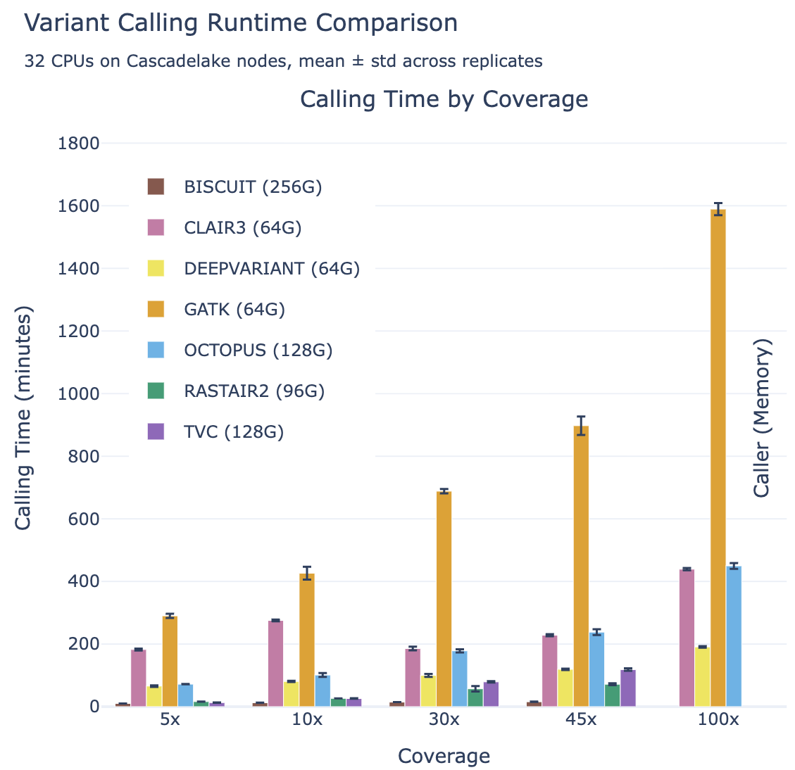
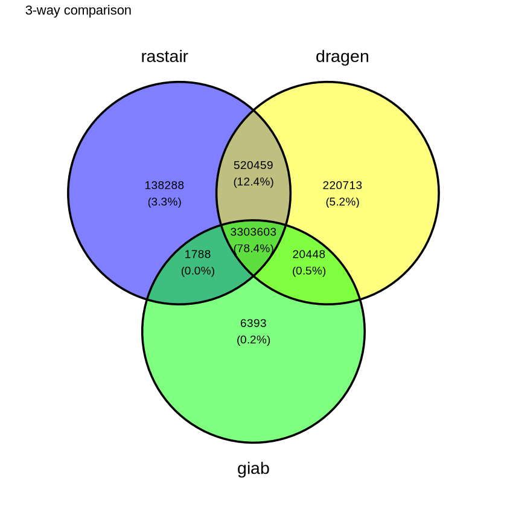
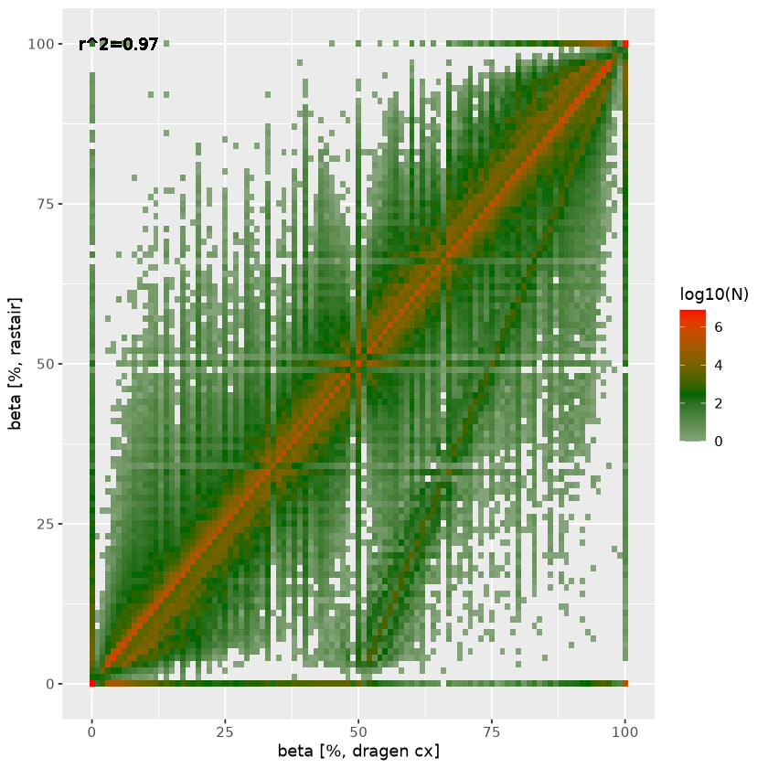

<!--  -->

<link rel="stylesheet" type="text/css" href="https://esm.sh/emfed@1/toots.css">

## Background
Rastair is a command-line tool that allows the simultaneous detection of genetic variants and methylated positions from short-read sequencing data that was generated using a "mod-C&rarr;T" method, such as @TAPS or Illumina's @5Base technology.

Traditional @bisulfite sequencing (BS-seq) converts *all* non-modified cytosine (C) to thymine (T). This results in reads that differ substantially from the reference and are thus harder to align. Converting most C to T also reduces the available information for variant identification. While several tools have been developed to overcome this problem, genetic variant calls from BS-seq remain substantially worse than those derived from whole-genome sequencing data.

In contrast, mod-C&rarr;T methods only affect around 60M positions in the human genome, equivalent to only approx. 2% of all nucleotides. This leads to greatly improved sequencing quality, higher mapping rates, and better yield from low-input DNA. It also makes it possible to identify genetic variation - in addition to epigenetic changes - with much higher accuracy. **Rastair implements a fast and accurate algorithm to simultaneously provide such high-quality variant *and* methylation calls.**

You can read more in our paper, [Rastair: an integrated variant and methylation caller](https://www.biorxiv.org/content/10.64898/2026.03.19.712983v1).

## Latest Updates
<section id="news">
  <a class="mastodon-feed"
     href="https://{{MSTDN_INSTANCE}}/{{MSTDN_ACCOUNT}}"
     data-toot-limit="2">
     Loading posts from {{MSTDN_ACCOUNT}}@{{MSTDN_INSTANCE}}...
  </a>
</section>

<script type="module" src="https://esm.sh/emfed@1"></script>

## Performance
### Rastair SNP calls on TAPS+ data

Rastair achieves similar variant-calling accuracy for SNP positions from TAPS+ and 5-Base data as state-of-the-art tools on "pure" whole-genome sequencing data, and significantly better than other tools built for TAPS+ or Bisulfite-seq data.

<div style="position:relative; padding-top:70%;">
  <iframe
    src="img/f1_by_coverage.html"
    style="position:absolute; inset:0; width:100%; height:100%; border:0;"
    loading="lazy"
  ></iframe>
</div>

Meanwhile, rastair is significantly faster than other callers with comparable accuracy:



### Rastair on 5-Base data

Rastair produces substantially fewer false-positives - at comparable sensitivity - than Illumina's DRAGEN 5-Base pipeline:

| Variant call overlap | Methylation overlap |
| ----- | ----- |
|  |  |

The Venn diagram on the left shows the overlap of SNPs called by rastair, [Illumina's DRAGEN 5-Base pipeline](https://help.dragen.illumina.com/product-guide/dragen-v4.4/dragen-methylation-pipeline/dragen-5base-pipeline), and the ["Genome In A Bottle"](https://www.nist.gov/programs-projects/genome-bottle) truth set. Rastair produces fewer false positives, at the expense of slightly lower sensitivity. F1 Score DRAGEN: **0.899**. F1 Score rastair: **0.906**

On the right, we plot the agreement in estimated beta between rastair (y-axis) and DRAGEN (x-axis). The straight line off the diagonal with an intercept at DRAGEN beta=0.5 represent heterozygous C>T (and G>A) SNPs where Ts (and As) that are in fact genetic variants are incorrectly counted as methylation. Rastair corrects for this, thus lowering the estimated beta at those loci. There is also a subset of positions where dragen estimates full methylation (beta=1) where rastair estimates beta=0: these are homozygous C>T/G>A SNPs.

## License

Rastair is free for academic and other non-commercial use, and the [code is available on GitHub](https://github.com/{{REPO_FULL_NAME}}). You can read the details of the license [here](https://github.com/{{REPO_FULL_NAME}}/blob/main/LICENSE.txt).

```admonish info
For commercial entities that would like to use rastair beyond internal evaluation, please contact [enquiries@innovation.ox.ac.uk](mailto:enquiries@innovation.ox.ac.uk?cc=benjamin.schuster-boeckler%40ludwig.ox.ac.uk&subject=Rastair%20%2F%20reference%2024811) quoting reference 24811.
```

## Quick start

### Installation
We provide pre-built binaries for [Linux (x86)](https://s3.{{S3_REGION}}.amazonaws.com/{{S3_BUCKET}}/build/release-{{VERSION}}/rastair-{{VERSION}}-x86_64-unknown-linux-gnu.tar.gz), [Mac (Apple Silicon)](https://s3.{{S3_REGION}}.amazonaws.com/{{S3_BUCKET}}/build/release-{{VERSION}}/rastair-{{VERSION}}-aarch64-apple-darwin.zip) and [Mac (Intel)](https://s3.{{S3_REGION}}.amazonaws.com/{{S3_BUCKET}}/build/release-{{VERSION}}/rastair-{{VERSION}}-x86_64-apple-darwin.zip). We also provide a [docker image](https://hub.docker.com/r/sbludwig/rastair) and a [conda package](installation.md#conda). For build instructions and more details, see the [installation page](installation.md).

### Usage

Call methylation at all CpG positions (including CpGs formed by SNPs) from a bam file and output as a @tabix\-indexed [bed file](formats/bed.md):

```bash
rastair call --bed output.bed.gz -r reference.fasta.gz input.bam
```
```admonish tip
By default, rastair will use all available CPU cores. You can restrict this with `-@ 1`.
```

Rastair can also produce variant and methylation calls in [VCF format](formats/vcf.md):

```bash
rastair call --vcf output.vcf.gz -r reference.fasta.gz input.bam
```

For a more in-depth look at different use-cases of rastair with practical examples, see the [examples](examples.md) section. For an explanation of the output file formats, see [BED](formats/bed.md) and [VCF](formats/vcf.md) sections.

## Get help

You can file an issue or question on our [issue tracker over on GitHub](https://github.com/{{REPO_FULL_NAME}}/issues)!

## Citing rastair

> Rastair: an integrated variant and methylation caller  
> Zohar Etzioni, Liyuan Zhao, Pascal Hertleif, Benjamin Schuster-Boeckler  
> [bioRxiv 2026.03.19.712983](https://www.biorxiv.org/content/10.64898/2026.03.19.712983v1);
> [doi.org/10.64898/2026.03.19.712983](https://doi.org/10.64898/2026.03.19.712983)
