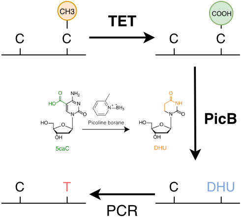

# Rastair2

Rastair is a CLI application that allows the simultaneous detection of genetic variants and methylated positions from short-read sequencing data created using [TET-Assisted Pyridine-Borane Sequencing](https://www.nature.com/articles/s41587-019-0041-2).

@TAPS is a unique semi-enzymatic method that differs from conventional bisulfite sequencing (BS) by only converting epigenetically modified cytosine to thymine, leaving all other genomic bases unchanged:

This means that in the human genome, TAPS only affects around 60M positions, equivalent to only approx. 2% of all nucleotides. This leads to greatly improved sequencing quality, higher mapping rates, and better yield from low-input DNA. it also makes it possible to accurately identify genetic variation in addition to epigenetic changes from the same round of TAPS sequencing. **Rastair implements this in a computationally performant way.**

For a brief introduction to the main use-cases of rastair with practical examples, see the [examples](examples.md) section. For an explanation of the output file formats, see [bed](formats/vcf.md) and [vcf](formats/vcf.md).