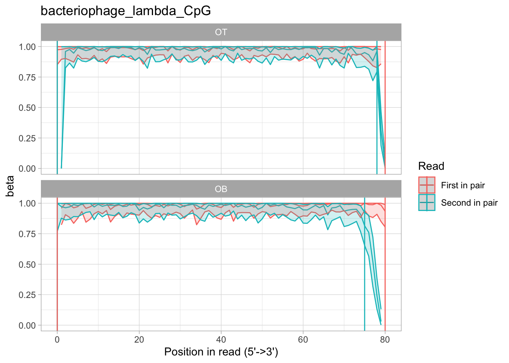
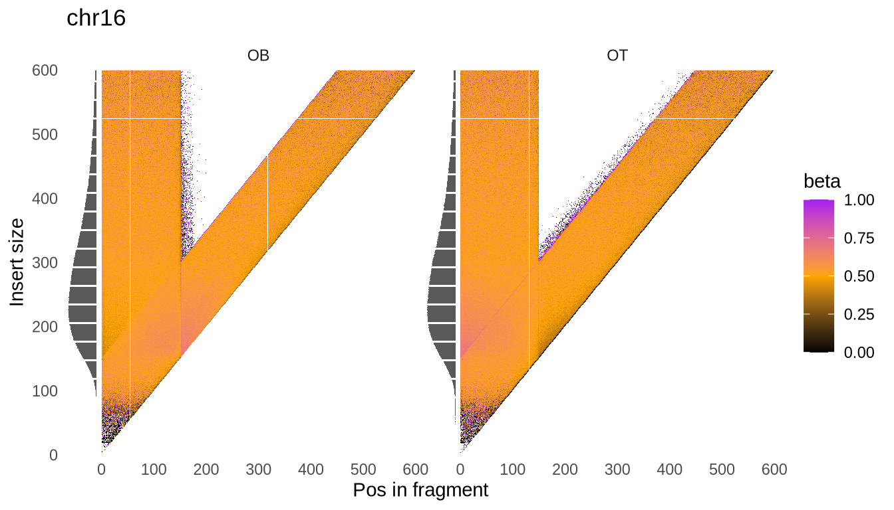

# Quality control report

Rastair comes with a helper script, written in [R](https://cran.r-project.org), which generates a comprehense QC report for your library.

```admonish info
**If not using the docker image:**
The QC tool requires a working installation of R with [RMarkdown](https://cran.r-project.org/web/packages/rmarkdown/index.html), [data.table](https://r-datatable.com), [ggplot2](https://ggplot2.tidyverse.org) and [argparser](https://cran.r-project.org/web/packages/argparser/index.html) libraries. You can install all of them at once with
> ```r
> install.packages(c("argparser", "data.table", "ggplot2", "rmarkdown"))
> ```
```

## Generating QC reports
To generate the report, you need to first generate per-read bed output as described in the [examples section](src/examples.md#3-report-methylation-per-read).

```admonish tip
You can speed this up by e.g. restricting to a smaller chromosome with e.g. `-l chr17` as an additional argument to `rastair per-read`.
```

Once you have your per-read output, you generate the html report with

```bash
mkdir -p test_qc
rastair mbias --output-prefix test_qc test_per-read.bed.gz
```

This will produce a file called `mbias.html` in the `test_qc` directory.

## Elements of the QC report

Conversion of methyl-C to T should be independent of where in a sequencing read the methylation ocurred.
However, in reality, a number of experimental procedures can affect the evenness of conversion. For example,
sonication or enzymatic digestion of genomic DNA can produce single-stranded ends. When these are repaired for
A-tailing, the newly synthesized parts will be unmethylated.

To identify any potential issues in your data, we are providing two types of plots to investigate the evenness of methylation:

### M-bias

The classic ["methylation bias"](https://genomebiology.biomedcentral.com/articles/10.1186/gb-2012-13-10-r83) (aka M-bias) plot shows the average methylation per position in a read:



```admonish info
Unlike other tools, we consistently use 5'&rarr;3' orientation per read, not per reference!
```

We distinguish between @OT and @OB fragments, and show average methylation for R1 and R2 reads separately. This is an example of an enzymatically fully methylated piece of DNA that we use as a control, so methylation is nearly 100% across most reads. However, you can see that the ends of R2 of OB fragments seem to have lost methylation information. This could be corrected with the [`--nOT` and `--nOB` arguments](./cli.md#filter-options) to `rastair call`.

To facilitate choosing the right cutoff parameters, we also generate a text file for each processed chromosome that contain the estimated optimal `--nOT` and `--nOB` settings, respectively.

In this example, the script produced this:

```bash
cat bacteriophage_lambda_CpG_cutoffs.txt
0,0,0,2
0,0,0,5
```

In other word, it suggested we set `--nOT 0,0,0,2` and `--nOB 0,0,0,5`, ie remove the last 2 and 5 bases of R2 in OT and OB, respectively.

### V-bias

In some cases, for example when DNA is enzymatically digested *in vivo* or *in vitro*, there might be a wide range of fragment sizes. We have observed in some instances that fragment size has an impact on methylation bias per read position. To visualise this, we provide what we call a "V-bias" plot:



Here, colour denotes methylation, while the y-axis reflects the length of the original fragment, assuming paired-end sequencing.
